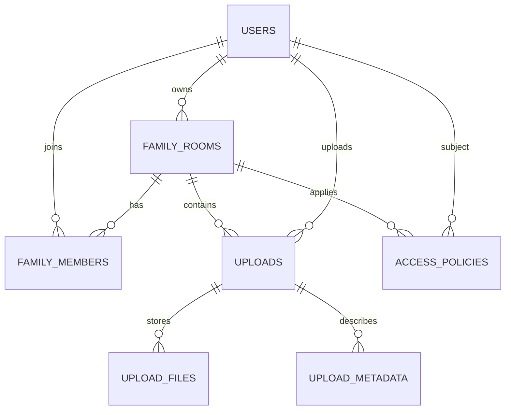

# Ambient Legacy Backend ERD Draft

## 설계 목표

- A 사용자가 생성한 가족방에 B 사용자가 실제로 참여할 수 있는 구조
- 업로드 데이터가 기기 로컬이 아니라 서버 기준으로 관리되는 구조
- 원본 파일과 메타데이터를 분리하여 저장하는 구조
- 이후 AI 분석 결과를 확장 컬럼 또는 별도 테이블로 자연스럽게 붙일 수 있는 구조

## 핵심 엔티티

### 1. users

- 역할: 사용자 계정 기본 정보 관리
- 주요 컬럼
  - `id` UUID PK
  - `google_sub` string unique
  - `email` string unique
  - `name` string
  - `profile_image` string nullable
  - `created_at` datetime
  - `updated_at` datetime

### 2. family_rooms

- 역할: 가족방 기본 정보 관리
- 주요 컬럼
  - `id` UUID PK
  - `name` string
  - `invite_code` string unique
  - `owner_user_id` UUID FK -> users.id
  - `created_at` datetime
  - `updated_at` datetime

### 3. family_members

- 역할: 사용자와 가족방의 다대다 관계 관리
- 주요 컬럼
  - `id` UUID PK
  - `room_id` UUID FK -> family_rooms.id
  - `user_id` UUID FK -> users.id
  - `role` string
  - `joined_at` datetime

## 주요 제약

- `(room_id, user_id)`는 unique
- `role` 예시: `owner`, `member`

### 4. uploads

- 역할: 업로드 단위 메타데이터 관리
- 주요 컬럼
  - `id` UUID PK
  - `room_id` UUID FK -> family_rooms.id
  - `uploader_user_id` UUID FK -> users.id
  - `type` string
  - `title` string
  - `description` text nullable
  - `status` string
  - `created_at` datetime
  - `updated_at` datetime

## type 예시

- `voice`
- `text`
- `image`
- `video`

## status 예시

- `uploaded`
- `processing`
- `completed`
- `failed`

### 5. upload_files

- 역할: 원본 파일 및 저장 경로 관리
- 주요 컬럼
  - `id` UUID PK
  - `upload_id` UUID FK -> uploads.id
  - `storage_bucket` string
  - `storage_path` string
  - `mime_type` string
  - `file_size` integer nullable
  - `encrypted` boolean
  - `created_at` datetime

### 6. upload_metadata

- 역할: 추출 텍스트 및 분석 결과 관리
- 주요 컬럼
  - `id` UUID PK
  - `upload_id` UUID FK -> uploads.id
  - `extracted_text` text nullable
  - `summary` text nullable
  - `keywords` text nullable
  - `confidence_score` float nullable
  - `reference_id` string nullable
  - `created_at` datetime
  - `updated_at` datetime

### 7. access_policies

- 역할: 가족 관계 기반 열람 정책 확장용
- 주요 컬럼
  - `id` UUID PK
  - `room_id` UUID FK -> family_rooms.id
  - `upload_id` UUID FK -> uploads.id nullable
  - `subject_user_id` UUID FK -> users.id
  - `permission` string
  - `created_at` datetime

## permission 예시

- `read`
- `write`
- `admin`

## 관계 요약

- `users 1:N family_rooms`
- `users N:M family_rooms` via `family_members`
- `family_rooms 1:N uploads`
- `users 1:N uploads`
- `uploads 1:N upload_files`
- `uploads 1:1 or 1:N upload_metadata`

## Mermaid ERD

## 1차 구현 범위

- `users`
- `family_rooms`
- `family_members`
- `uploads`
- `upload_files`

## 2차 확장 범위

- `upload_metadata`
- `access_policies`
- AI 파이프라인 결과 테이블

